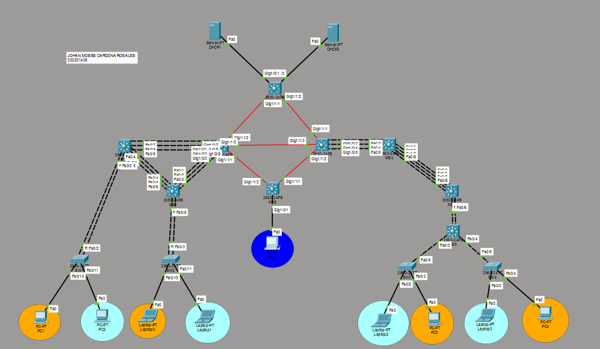

# Proyecto 1 - Chapin Red
**Redes de Computadoras 2 - USAC**

- **Carnet:** 202201405
- **Nombre:** Johan Moises Cardona Rosales
- **Repositorio:** REDES2_1S2026_202201405

---

## Índice

1. [Topología](#topología)
2. [Direccionamiento IP y Subnetting](#direccionamiento-ip-y-subnetting)
3. [VLANs](#vlans)
4. [Configuración VTP](#configuración-vtp)
5. [EtherChannel LACP - Edificio Izquierdo](#etherchannel-lacp---edificio-izquierdo)
6. [EtherChannel PAgP - Edificio Derecho](#etherchannel-pagp---edificio-derecho)
7. [Enrutamiento Dinámico EIGRP](#enrutamiento-dinámico-eigrp)
8. [Configuración DHCP](#configuración-dhcp)
9. [ACLs - Control de Acceso](#acls---control-de-acceso)
10. [Spanning Tree Protocol](#spanning-tree-protocol)
11. [Pruebas y Validación](#pruebas-y-validación)

---

## Topología

### Topología General



#### Red MAN (Metropolitan Area Network)

Conexión entre edificios mediante switches multicapa Cisco 3650 con fibra óptica (módulos GLC-LH-SMD).

| Enlace | Switch A | Puerto A | Switch B | Puerto B |
|--------|----------|----------|----------|----------|
| MS1 ↔ MS7 | MS1 | Gi1/1/1 | MS7 | Gi1/1/2 |
| MS1 ↔ MS2 | MS1 | Gi1/1/2 | MS2 | Gi1/1/1 |
| MS7 ↔ MS2 | MS7 | Gi1/1/3 | MS2 | Gi1/1/3 |
| MS7 ↔ MS6 | MS7 | Gi1/1/1 | MS6 | Gi1/1/2 |
| MS2 ↔ MS6 | MS2 | Gi1/1/2 | MS6 | Gi1/1/1 |
| MS1 ↔ DHCP1 | MS1 | Gi1/0/1 | DHCP1 | Fa0 |
| MS1 ↔ DHCP2 | MS1 | Gi1/0/2 | DHCP2 | Fa0 |

#### Edificio Izquierdo (LACP)

| Enlace | Switch A | Puertos A | Switch B | Puertos B | Port-Channel |
|--------|----------|-----------|----------|-----------|--------------|
| MS7 ↔ MS8 | MS7 | Gi1/0/1-3 | MS8 | Fa0/1-3 | Po1 |
| MS7 ↔ MS9 | MS7 | Gi1/0/7-9 | MS9 | Fa0/7-9 | Po2 |
| MS9 ↔ MS8 | MS9 | Fa0/4-6 | MS8 | Fa0/4-6 | Po3 |

#### Edificio Derecho (PAgP)

| Enlace | Switch A | Puertos A | Switch B | Puertos B | Port-Channel |
|--------|----------|-----------|----------|-----------|--------------|
| MS2 ↔ MS3 | MS2 | Gi1/0/2,4,5 | MS3 | Fa0/2,4,5 | Po1 |
| MS3 ↔ MS4 | MS3 | Fa0/3,6,7,8 | MS4 | Fa0/3,6,7,8 | Po2 |
| MS4 ↔ MS5 | MS4 | Fa0/4,5 | MS5 | Fa0/5,6 | Po3 |

---

## Direccionamiento IP y Subnetting

### Redes Base

- **VLANs:** 192.188.5.0/24
- **Enlaces:** 10.4.5.0/24

### Subnetting VLANs (192.188.5.0/24 → /27)

| VLAN | Red | Máscara | Gateway | Rango Hosts | Broadcast |
|------|-----|---------|---------|-------------|-----------|
| 55 - Naranja IZQ | 192.188.5.0/27 | 255.255.255.224 | 192.188.5.1 | 192.188.5.2 - 192.188.5.30 | 192.188.5.31 |
| 65 - Verde IZQ | 192.188.5.32/27 | 255.255.255.224 | 192.188.5.33 | 192.188.5.34 - 192.188.5.62 | 192.188.5.63 |
| 75 - Naranja DER | 192.188.5.64/27 | 255.255.255.224 | 192.188.5.65 | 192.188.5.66 - 192.188.5.94 | 192.188.5.95 |
| 85 - Verde DER | 192.188.5.96/27 | 255.255.255.224 | 192.188.5.97 | 192.188.5.98 - 192.188.5.126 | 192.188.5.127 |
| 95 - ADMIN | 192.188.5.128/27 | 255.255.255.224 | 192.188.5.129 | 192.188.5.130 - 192.188.5.158 | 192.188.5.159 |

### Subnetting Enlaces (10.4.5.0/24 → /30)

| Enlace | Red | IP Switch A | IP Switch B |
|--------|-----|-------------|-------------|
| MS1 Gi1/1/1 ↔ MS7 Gi1/1/2 | 10.4.5.0/30 | MS1: 10.4.5.1 | MS7: 10.4.5.2 |
| MS1 Gi1/1/2 ↔ MS2 Gi1/1/1 | 10.4.5.4/30 | MS1: 10.4.5.5 | MS2: 10.4.5.6 |
| MS7 Gi1/1/3 ↔ MS2 Gi1/1/3 | 10.4.5.8/30 | MS7: 10.4.5.9 | MS2: 10.4.5.10 |
| MS7 Gi1/1/1 ↔ MS6 Gi1/1/2 | 10.4.5.12/30 | MS7: 10.4.5.13 | MS6: 10.4.5.14 |
| MS2 Gi1/1/2 ↔ MS6 Gi1/1/1 | 10.4.5.16/30 | MS2: 10.4.5.17 | MS6: 10.4.5.18 |
| MS1 Gi1/0/1 ↔ DHCP1 | 10.4.5.20/30 | MS1: 10.4.5.21 | DHCP1: 10.4.5.22 |
| MS1 Gi1/0/2 ↔ DHCP2 | 10.4.5.24/30 | MS1: 10.4.5.25 | DHCP2: 10.4.5.26 |

---

## VLANs

| ID | Nombre | Edificio | Color |
|----|--------|----------|-------|
| 55 | VLAN_Naranja_EdificioIZQ_202201405 | Izquierdo | Naranja |
| 65 | VLAN_Verde_EdificioIZQ_202201405 | Izquierdo | Verde |
| 75 | VLAN_Naranja_EdificioDER_202201405 | Derecho | Naranja |
| 85 | VLAN_Verde_EdificioDER_202201405 | Derecho | Verde |
| 95 | VLAN_ADMIN_202201405 | Administración | Azul |

### Dispositivos Finales por VLAN

| Dispositivo | Switch | Puerto | VLAN | IP Asignada por DHCP |
|-------------|--------|--------|------|----------------------|
| PC1 | SW1 | Fa0/10 | 55 | Dinámica |
| PC2 | SW1 | Fa0/11 | 65 | Dinámica |
| Laptop0 | SW2 | Fa0/10 | 55 | Dinámica |
| Laptop1 | SW2 | Fa0/11 | 65 | Dinámica |
| PC3 | SW3 | Fa0/3 | 75 | Dinámica |
| Laptop2 | SW3 | Fa0/2 | 85 | Dinámica |
| PC4 | SW4 | Fa0/4 | 75 | Dinámica |
| Laptop3 | SW4 | Fa0/3 | 85 | Dinámica |
| PC0 | MS6 | Gi1/0/1 | 95 | Dinámica |

> **Nota:** Las direcciones IP finales se asignan dinámicamente por DHCP.
---

## Configuración VTP

- **Dominio:** chapinred
- **Contraseña:** chapinred123
- **Versión:** 2

| Switch | Rol VTP |
|--------|---------|
| MS1 | Server |
| MS2, MS3, MS4, MS5, MS6, MS7, MS8, MS9, SW1, SW2, SW3, SW4 | Client |

### Comandos VTP Server (MS1)
```
configure terminal
vtp mode server
vtp domain chapinred
vtp password chapinred123
vtp version 2

vlan 55
 name VLAN_Naranja_EdificioIZQ_202201405
vlan 65
 name VLAN_Verde_EdificioIZQ_202201405
vlan 75
 name VLAN_Naranja_EdificioDER_202201405
vlan 85
 name VLAN_Verde_EdificioDER_202201405
vlan 95
 name VLAN_ADMIN_202201405
exit
write memory
```

### Comandos VTP Client
```
configure terminal
vtp mode client
vtp domain chapinred
vtp password chapinred123
exit
write memory
```

### Verificación VTP
```
show vtp status
show vlan brief
```

---

## EtherChannel LACP - Edificio Izquierdo

### MS7
```
configure terminal

interface range GigabitEthernet1/0/1-3
 switchport mode trunk
 channel-protocol lacp
 channel-group 1 mode active
exit

interface range GigabitEthernet1/0/7-9
 switchport mode trunk
 channel-protocol lacp
 channel-group 2 mode active
exit

interface port-channel 1
 switchport mode trunk
exit

interface port-channel 2
 switchport mode trunk
exit

write memory
```

### MS8
```
configure terminal

interface range FastEthernet0/1-3
 switchport trunk encapsulation dot1q
 switchport mode trunk
 channel-protocol lacp
 channel-group 1 mode passive
exit

interface range FastEthernet0/4-6
 switchport trunk encapsulation dot1q
 switchport mode trunk
 channel-protocol lacp
 channel-group 3 mode passive
exit

interface port-channel 1
 switchport trunk encapsulation dot1q
 switchport mode trunk
exit

interface port-channel 3
 switchport trunk encapsulation dot1q
 switchport mode trunk
exit

write memory
```

### MS9
```
configure terminal

interface range FastEthernet0/7-9
 switchport trunk encapsulation dot1q
 switchport mode trunk
 channel-protocol lacp
 channel-group 2 mode passive
exit

interface range FastEthernet0/4-6
 switchport trunk encapsulation dot1q
 switchport mode trunk
 channel-protocol lacp
 channel-group 3 mode active
exit

interface port-channel 2
 switchport trunk encapsulation dot1q
 switchport mode trunk
exit

interface port-channel 3
 switchport trunk encapsulation dot1q
 switchport mode trunk
exit

write memory
```

### Verificación LACP
```
show etherchannel summary
show interfaces trunk
```

---

## EtherChannel PAgP - Edificio Derecho

### MS2
```
configure terminal

interface GigabitEthernet1/0/2
 switchport mode trunk
 channel-protocol pagp
 channel-group 1 mode desirable
exit

interface GigabitEthernet1/0/4
 switchport mode trunk
 channel-protocol pagp
 channel-group 1 mode desirable
exit

interface GigabitEthernet1/0/5
 switchport mode trunk
 channel-protocol pagp
 channel-group 1 mode desirable
exit

interface port-channel 1
 switchport mode trunk
exit

write memory
```

### MS3
```
configure terminal

interface range FastEthernet0/2,FastEthernet0/4-5
 switchport trunk encapsulation dot1q
 switchport mode trunk
 channel-protocol pagp
 channel-group 1 mode auto
exit

interface range FastEthernet0/3,FastEthernet0/6-8
 switchport trunk encapsulation dot1q
 switchport mode trunk
 channel-protocol pagp
 channel-group 2 mode desirable
exit

write memory
```

### MS4
```
configure terminal

interface range FastEthernet0/3,FastEthernet0/6-8
 switchport trunk encapsulation dot1q
 switchport mode trunk
 channel-protocol pagp
 channel-group 2 mode auto
exit

interface range FastEthernet0/4-5
 switchport trunk encapsulation dot1q
 switchport mode trunk
 channel-protocol pagp
 channel-group 3 mode desirable
exit

write memory
```

### MS5
```
configure terminal

interface range FastEthernet0/5-6
 switchport trunk encapsulation dot1q
 switchport mode trunk
 channel-protocol pagp
 channel-group 3 mode auto
exit

write memory
```

### Verificación PAgP
```
show etherchannel summary
show interfaces trunk
```

---

## Enrutamiento Dinámico EIGRP

- **Protocolo:** EIGRP
- **AS Number:** 1

### MS1
```
configure terminal
ip routing

interface GigabitEthernet1/1/1
 no switchport
 ip address 10.4.5.1 255.255.255.252
exit

interface GigabitEthernet1/1/2
 no switchport
 ip address 10.4.5.5 255.255.255.252
exit

interface GigabitEthernet1/0/1
 no switchport
 ip address 10.4.5.21 255.255.255.252
exit

interface GigabitEthernet1/0/2
 no switchport
 ip address 10.4.5.25 255.255.255.252
exit

router eigrp 1
 network 10.4.5.0 0.0.0.3
 network 10.4.5.4 0.0.0.3
 network 10.4.5.20 0.0.0.3
 network 10.4.5.24 0.0.0.3
exit

write memory
```

### MS7
```
configure terminal
ip routing

interface GigabitEthernet1/1/1
 no switchport
 ip address 10.4.5.13 255.255.255.252
exit

interface GigabitEthernet1/1/2
 no switchport
 ip address 10.4.5.2 255.255.255.252
exit

interface GigabitEthernet1/1/3
 no switchport
 ip address 10.4.5.9 255.255.255.252
exit

interface Vlan55
 ip address 192.188.5.1 255.255.255.224
 ip helper-address 10.4.5.22
exit

interface Vlan65
 ip address 192.188.5.33 255.255.255.224
 ip helper-address 10.4.5.22
exit

router eigrp 1
 network 192.188.5.0 0.0.0.31
 network 192.188.5.32 0.0.0.31
 network 10.4.5.0 0.0.0.3
 network 10.4.5.8 0.0.0.3
 network 10.4.5.12 0.0.0.3
exit

write memory
```

### MS2
```
configure terminal
ip routing

interface GigabitEthernet1/1/1
 no switchport
 ip address 10.4.5.6 255.255.255.252
exit

interface GigabitEthernet1/1/2
 no switchport
 ip address 10.4.5.17 255.255.255.252
exit

interface GigabitEthernet1/1/3
 no switchport
 ip address 10.4.5.10 255.255.255.252
exit

interface Vlan75
 ip address 192.188.5.65 255.255.255.224
 ip helper-address 10.4.5.26
exit

interface Vlan85
 ip address 192.188.5.97 255.255.255.224
 ip helper-address 10.4.5.26
exit

router eigrp 1
 network 192.188.5.64 0.0.0.31
 network 192.188.5.96 0.0.0.31
 network 10.4.5.4 0.0.0.3
 network 10.4.5.8 0.0.0.3
 network 10.4.5.16 0.0.0.3
exit

write memory
```

### MS6
```
configure terminal
ip routing

interface GigabitEthernet1/1/1
 no switchport
 ip address 10.4.5.18 255.255.255.252
exit

interface GigabitEthernet1/1/2
 no switchport
 ip address 10.4.5.14 255.255.255.252
exit

interface Vlan95
 ip address 192.188.5.129 255.255.255.224
 ip helper-address 10.4.5.22
exit

interface GigabitEthernet1/0/1
 switchport mode access
 switchport access vlan 95
 no shutdown
exit

router eigrp 1
 network 192.188.5.128 0.0.0.31
 network 10.4.5.12 0.0.0.3
 network 10.4.5.16 0.0.0.3
exit

write memory
```

### Verificación EIGRP
```
show ip route
show ip eigrp neighbors
```

---

## Configuración DHCP

### DHCP1 (Servidor Edificio Izquierdo y ADMIN)

- **IP:** 10.4.5.22
- **Gateway correcto:** 10.4.5.21

| Pool | Default Gateway | Start IP | Subnet Mask | Max Users |
|------|-----------------|----------|-------------|-----------|
| VLAN55 | 192.188.5.1 | 192.188.5.2 | 255.255.255.224 | 29 |
| VLAN65 | 192.188.5.33 | 192.188.5.34 | 255.255.255.224 | 29 |
| VLAN95 | 192.188.5.129 | 192.188.5.130 | 255.255.255.224 | 29 |

> **Corrección realizada:** el gateway del servidor DHCP1 no debe ser 10.4.5.22, sino 10.4.5.21.

### DHCP2 (Servidor Edificio Derecho)

- **IP:** 10.4.5.26
- **Gateway:** 10.4.5.25

| Pool | Default Gateway | Start IP | Subnet Mask | Max Users |
|------|-----------------|----------|-------------|-----------|
| VLAN75 | 192.188.5.65 | 192.188.5.66 | 255.255.255.224 | 29 |
| VLAN85 | 192.188.5.97 | 192.188.5.98 | 255.255.255.224 | 29 |

### DHCP Relay (IP Helper)

**MS7**
```
interface Vlan55
 ip helper-address 10.4.5.22
exit

interface Vlan65
 ip helper-address 10.4.5.22
exit
```

**MS2**
```
interface Vlan75
 ip helper-address 10.4.5.26
exit

interface Vlan85
 ip helper-address 10.4.5.26
exit
```

**MS6**
```
interface Vlan95
 ip helper-address 10.4.5.22
exit
```

### Observaciones importantes de DHCP

- Todos los hosts finales deben trabajar con IP dinámica.
- PC0 no obtenía IP inicialmente porque:
  - el puerto Gi1/0/1 de MS6 no estaba confirmado en VLAN95,
  - el pool VLAN95 tenía mal el default gateway,
  - y todavía existían ACL antiguas en enlaces capa 3 que bloqueaban tráfico.
- Una vez corregido lo anterior, PC0 recibió IP 192.188.5.130/27 correctamente.

### Verificación DHCP
```
show ip interface brief
```

En PCs:
```
ipconfig
```

---

## ACLs - Control de Acceso

### Política final implementada

| Origen | Destino | Acción |
|--------|---------|--------|
| VLAN55 | VLAN65 | Bloqueado |
| VLAN65 | VLAN55 | Bloqueado |
| VLAN75 | VLAN85 | Bloqueado |
| VLAN85 | VLAN75 | Bloqueado |
| VLAN55, VLAN65, VLAN75, VLAN85 | ADMIN | Permitido |
| ADMIN | Todas las VLAN | Permitido |
| DHCP / Routing | — | Permitido |

### Recomendación aplicada

Las ACL **no deben colocarse** en interfaces `Gi1/1/x` del backbone, porque eso rompe el DHCP relay, EIGRP, la conectividad entre edificios y el acceso a VLAN95. Las ACL deben aplicarse en las **interfaces VLAN (SVI)**.

### ACL Edificio Izquierdo - MS7
```
conf t
ip access-list extended ACL_VLAN55_65
 deny ip 192.188.5.0 0.0.0.31 192.188.5.32 0.0.0.31
 deny ip 192.188.5.32 0.0.0.31 192.188.5.0 0.0.0.31
 permit ip any any
exit

interface Vlan55
 ip access-group ACL_VLAN55_65 in
exit

interface Vlan65
 ip access-group ACL_VLAN55_65 in
exit

write memory
```

### ACL Edificio Derecho - MS2
```
conf t
ip access-list extended ACL_VLAN75_85
 deny ip 192.188.5.64 0.0.0.31 192.188.5.96 0.0.0.31
 deny ip 192.188.5.96 0.0.0.31 192.188.5.64 0.0.0.31
 permit ip any any
exit

interface Vlan75
 ip access-group ACL_VLAN75_85 in
exit

interface Vlan85
 ip access-group ACL_VLAN75_85 in
exit

write memory
```

### Verificación ACL
```
show access-lists
show ip interface vlan 55
show ip interface vlan 65
show ip interface vlan 75
show ip interface vlan 85
```

### Resultado esperado

- Ping de VLAN55 a VLAN65: debe **fallar**
- Ping de VLAN75 a VLAN85: debe **fallar**
- Ping desde cualquier VLAN a ADMIN: debe **funcionar**
- DHCP debe seguir funcionando

> **Nota:** en Packet Tracer puede ocurrir que `show running-config | include access-group` no muestre correctamente la aplicación. La verificación más confiable es `show ip interface vlan XX`, `show running-config | section VlanXX`, y pruebas reales de conectividad.

---

## Spanning Tree Protocol

### Root Bridge
```
configure terminal
spanning-tree vlan 55 root primary
spanning-tree vlan 65 root primary
exit
```
> en MS7 (para VLANs 55 y 65)
```
configure terminal
spanning-tree vlan 75 root primary
spanning-tree vlan 85 root primary
exit
```
> en MS2 (para VLANs 75 y 85)

### Verificación STP
```
show spanning-tree vlan 55
show spanning-tree vlan 65
show spanning-tree vlan 75
show spanning-tree vlan 85
```

---

## Pruebas y Validación

### Pruebas base sin ACL

- Todos los hosts reciben IP por DHCP.
- PC0 recibe IP en VLAN95.
- MS1 aprende la ruta 192.188.5.128/27 por EIGRP.
- Comunicación entre edificios operativa.
- EtherChannel LACP y PAgP operativos.

### Pruebas con ACL

- VLAN55 → VLAN65 = **bloqueado**
- VLAN65 → VLAN55 = **bloqueado**
- VLAN75 → VLAN85 = **bloqueado**
- VLAN85 → VLAN75 = **bloqueado**
- Cualquier VLAN → ADMIN = **permitido**
- ADMIN → cualquier VLAN = **permitido**

### Comandos generales de verificación
```
show ip interface brief
show ip route
show ip eigrp neighbors
show vlan brief
show interfaces trunk
show etherchannel summary
show vtp status
show access-lists
show spanning-tree
```

---

## Observaciones finales

Durante la implementación se corrigieron los siguientes problemas:

**1. Gateway incorrecto en DHCP1**
- Incorrecto: `10.4.5.22`
- Correcto: `10.4.5.21`

**2. Pool VLAN95 mal configurado**
- Default gateway incorrecto: `192.188.5.128`
- Correcto: `192.188.5.129`

**3. Puerto de PC0**
- Debe estar en MS6 `Gi1/0/1`
- En modo access
- Asignado a VLAN95

**4. ACL mal aplicadas inicialmente**
- Error: aplicar ACL en interfaces `Gi1/1/x`
- Solución: aplicar ACL en interfaces VLAN

**5. Problema de validación en Packet Tracer**
- Algunos comandos no reflejan bien la aplicación del ACL
- Se recomienda validar con tráfico real y `show ip interface vlan XX`